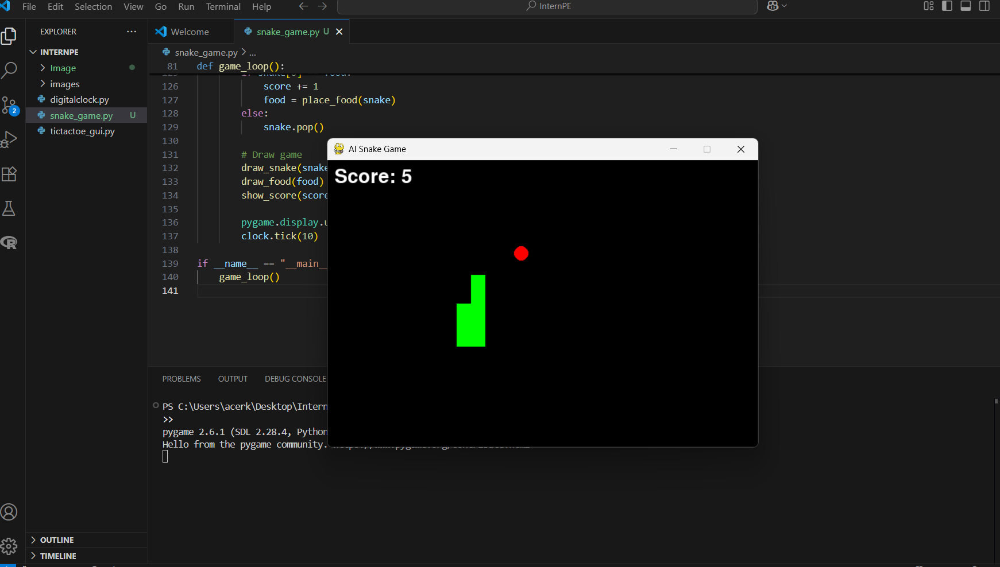

# 🐍 AI Snake Game (Python + Pygame)

An **automatic snake game** built using **Python** and **Pygame** where the snake moves by itself to catch food using a shortest path algorithm (**BFS**).  
The game ends when the snake is trapped or hits the wall/self.

---

## 🎮 Features
- Snake moves automatically towards food.
- **Shortest path algorithm (BFS)** to navigate.
- Game Over screen with final score.
- Smooth animation with Pygame.
- Easy to customize (speed, colors, grid size).

---

## 📸 Screenshot
*(Replace with your screenshot)*


---

## 🚀 How to Run

### 1️⃣ Install Python
Make sure you have Python **3.10+** installed.  
[Download Python here](https://www.python.org/downloads/)

### 2️⃣ Install Pygame
```bash
pip install pygame
```
3️⃣ Run the Game
```bash
python snake_game.py
